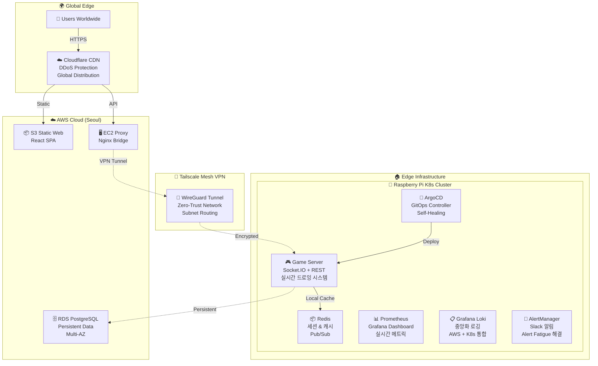

# 🎮 DrawGuess - 하이브리드 클라우드 GitOps 인프라 학습 프로젝트

> **라즈베리파이 Kubernetes 클러스터와 AWS 클라우드를 Tailscale VPN으로 연결한 하이브리드 클라우드 환경에서 GitOps 기반 자동 배포 시스템을 구축하고, Socket.IO 실시간 멀티플레이어 게임을 통해 완전한 관찰성 스택을 학습하는 DevOps 인프라 프로젝트**

[](https://hwara-dev.kr/)  

---

## 🏆 **핵심 학습 성과**

|🎯 **학습 특징**|📊 **구현 성과**|🔧 **기술 스택**|
|---|---|---|
|**하이브리드 클라우드 설계**|실시간(Edge) + 영구(Cloud) 분산|라즈베리파이 K8s + AWS RDS|
|**완전 자동화 GitOps**|Git Push → 자동배포 + Self-Healing|ArgoCD + GitHub Actions|
|**완전한 관찰성 스택**|메트릭 + 로그 + 알림 통합 시스템|Prometheus + Loki + AlertManager|
|**멀티 아키텍처 지원**|AMD64 + ARM64 동시 빌드|Docker Buildx + Private Registry|
|**엣지 컴퓨팅 최적화**|4GB RAM에서 다중 서비스 운영|Resource Tuning + K8s 최적화|
|**실시간 통신 기반**|Socket.IO 멀티플레이어 아키텍처|WebSocket + Redis + PostgreSQL|

---

## 🎮 **현재 구현 상태 & 시연**

### **🌐 운영 중인 인프라**

- **웹사이트**: [https://hwara-dev.kr](https://hwara-dev.kr/)
- **게임 플레이**: [https://hwara-dev.kr/draw-guess](https://hwara-dev.kr/draw-guess)
- **서버 모니터링**: [https://hwara-dev.kr/server-status](https://hwara-dev.kr/server-status)

### **📊 실시간 모니터링 대시보드**

- **Grafana**: http://172.30.1.104 (VPN 접근)
- **ArgoCD**: http://172.30.1.105 (GitOps 대시보드)

### **✅ 현재 구현 완료**

- 🏗️ **하이브리드 클라우드 인프라**: Terraform AWS IaC + 라즈베리파이 K8s + Tailscale VPN
- 🚀 **GitOps 자동 배포**: ArgoCD + Self-Healing + GitHub Actions CI/CD
- 🤖 **Self-hosted Runner**: 라즈베리파이 기반 Private Registry 직접 접근
- 📊 **통합 모니터링**: Prometheus + Grafana + 시스템 메트릭
- 📋 **중앙화 로깅**: Grafana Loki + Promtail (AWS EC2 + K8s 통합)
- 🚨 **지능형 알림**: AlertManager + Slack 연동 + Alert Fatigue 해결
- 🎮 **완전한 멀티플레이어 게임**: Socket.IO 실시간 드로잉 + 채팅 + 순위 시스템
- 🗄️ **하이브리드 데이터**: Redis(실시간) + PostgreSQL(영구저장) 아키텍처

### **🔄 현재 학습 진행 중**

- 🎨 **게임 기능 세부 튜닝**: 사용자 경험 개선, 안정성 향상
- 📈 **성능 최적화**: 라즈베리파이 리소스 효율성 개선

---

## 🏗️ **하이브리드 클라우드 아키텍처**



### **🎯 하이브리드 설계 철학**

|**계층**|**배치 위치**|**선택 근거**|
|---|---|---|
|**정적 콘텐츠**|☁️ AWS S3 + Cloudflare|글로벌 CDN 활용|
|**실시간 통신**|🥧 라즈베리파이 Edge|WebSocket 지연시간 최소화|
|**영구 데이터**|☁️ AWS RDS|가용성 + 자동 백업|
|**네트워킹**|🔗 Tailscale VPN|Zero-Trust + NAT 트래버싱|

---

## 🚀 **핵심 기술 스택 & 차별화 요소**

### **🌊 하이브리드 클라우드 전문성** ⭐⭐⭐⭐⭐

```yaml
Physical Infrastructure:
  - Raspberry Pi 4 (ARM64) + USB SSD
  - Home Network Integration
  - Edge Computing Optimization

Cloud Infrastructure as Code:
  - Terraform: AWS VPC + EC2 + RDS + S3 프로비저닝
  - State Management: Terraform State 관리
  - Infrastructure Versioning: Git 기반 인프라 버전 관리

Hybrid Connectivity:
  - Tailscale Mesh VPN (WireGuard)
  - Subnet Route Advertisement  
  - Zero-Trust Architecture

CI/CD Integration:
  - GitHub Actions Self-hosted Runner
  - Private Registry Internal Access
  - Cross-Network Build Pipeline
```

### **⚙️ GitOps & DevOps 자동화**

```yaml
GitOps Implementation:
  - ArgoCD: Declarative Infrastructure
  - Self-Healing: Configuration Drift 자동 복구
  - Progressive Sync: 자동 동기화

CI/CD Pipeline:
  - GitHub Actions: Workflow 기반 자동화
  - Self-hosted Runner: 라즈베리파이에서 직접 실행
  - Private Registry Access: Internal Network 직접 연결
  - Multi-architecture Build: AMD64 + ARM64 동시 빌드

Infrastructure as Code:
  - Terraform: AWS 클라우드 인프라 프로비저닝 (VPC, EC2, RDS, S3)
  - Kubernetes Manifests: 컨테이너 워크로드 선언적 관리
  - Git Single Source of Truth: 모든 인프라 코드 버전 관리
  - Automated Rollback: 인프라 + 애플리케이션 통합 롤백
```

### **📊 완전한 관찰성 (Complete Observability)**

```yaml
Metrics Collection:
  - Prometheus: 시계열 메트릭 수집 및 저장
  - Grafana: 통합 대시보드 및 시각화
  - Node Exporter: 시스템 메트릭
  - Custom Metrics: 애플리케이션 지표

Centralized Logging:
  - Grafana Loki: 경량 로그 집계 시스템
  - Promtail: 분산 로그 수집 (K8s + Docker)
  - LogQL: 고급 로그 쿼리 및 필터링
  - AWS + K8s 통합: 하이브리드 로그 중앙화

Intelligent Alerting:
  - AlertManager: 지능형 알림 라우팅
  - Slack Integration: 실시간 알림 수신
  - Alert Fatigue 해결: 불필요한 알림 제거
  - Alert Routing: 심각도별 차별화된 알림
```

### **🐳 컨테이너 & Kubernetes 최적화**

```yaml
Kubernetes Cluster:
  - Single-node Production Cluster
  - containerd + Docker 공존
  - MetalLB LoadBalancer (L2 Mode)

Resource Optimization:
  - 4GB RAM에서 다중 서비스 운영
  - Memory Limits & Requests 세밀 조정
  - ARM64 Native Performance

Container Strategy:
  - Multi-architecture Images
  - Private Registry (Harbor Alternative)
  - Self-signed TLS Certificate Management
```

---

## 🛠️ **시스템 접근 & 기술 검증**

### **🌐 공개 접근 가능한 엔드포인트**

```bash
# 웹사이트 접근
curl -I https://hwara-dev.kr
# → Cloudflare CDN + AWS S3 정적 호스팅 (Terraform 프로비저닝)

# API 헬스체크  
curl -s https://api.hwara-dev.kr/health | jq
# → AWS EC2 → Tailscale VPN → 라즈베리파이 K8s

# 시스템 상태 모니터링
curl -s https://api.hwara-dev.kr/api/status | jq
# → Prometheus 통합 메트릭 + 실시간 시스템 상태
```

### **🏗️ Infrastructure as Code 검증**

```bash
# Terraform 인프라 상태 확인
terraform plan   # 인프라 변경사항 미리보기
terraform show   # 현재 프로비저닝된 리소스 상태

# AWS 리소스 확인
aws ec2 describe-instances --region ap-northeast-2
aws rds describe-db-instances --region ap-northeast-2
aws s3 ls s3://hwara-dev.kr

# Kubernetes 리소스 확인  
kubectl get all -A  # 모든 네임스페이스 리소스
kubectl get nodes -o wide  # 클러스터 노드 상태
```

### **🔧 GitOps 워크플로 검증**

```bash
# 1. 코드 변경사항 Push
git clone https://github.com/Hwara/DrawGuess.git
# 게임 서버 코드 수정 후 Push

# 2. GitHub Actions 자동 빌드 확인
# Self-hosted Runner가 라즈베리파이에서 실행
# Private Registry (172.30.1.64:32000) 직접 접근
# Multi-arch Build: AMD64 + ARM64

# 3. ArgoCD 자동 동기화 확인
# GitOps Manifest 업데이트 → ArgoCD 감지 → 자동 배포

# 4. 배포 결과 확인
curl https://api.hwara-dev.kr/health
# 새 버전 자동 반영 확인
```

### **📊 모니터링 시스템 확인**

```bash
# ArgoCD GitOps 대시보드 (VPN 접근)
# http://172.30.1.105

# Grafana 통합 모니터링 (VPN 접근)  
# http://172.30.1.104

# 중앙화 로깅 확인
# Grafana Loki를 통한 AWS EC2 + K8s 통합 로그 조회
```

---

## 📚 **상세 기술 문서**

### **📋 완전한 프로젝트 문서**

- 📐 **[전체 아키텍처 다이어그램](https://github.com/Hwara/DrawGuess/blob/main/docs/architecture.md)** - 하이브리드 클라우드 전체 구조
- 🏗️ **[Terraform IaC 구성](https://github.com/Hwara/DrawGuess/blob/main/docs/terraform-infrastructure.md)** - AWS 인프라 코드 및 설계
- 🚀 **[GitOps 워크플로 가이드](https://github.com/Hwara/DrawGuess/blob/main/docs/gitops-workflow.md)** - 선언적 인프라 관리 패턴
- 🔧 **[CI/CD 파이프라인 구축](https://github.com/Hwara/DrawGuess/blob/main/docs/cicd-setup.md)** - Self-hosted Runner 기반 자동화
- 📊 **[운영 현황 리포트](https://github.com/Hwara/DrawGuess/blob/main/docs/operations-report.md)** - 실제 성과 및 학습 내용

### **🛠️ 구현 상세 가이드**

- 🚀 **[CI/CD 파이프라인 구축](https://github.com/Hwara/DrawGuess/blob/main/docs/cicd-setup.md)** - GitHub Actions + Self-hosted Runner 완전 가이드
- 🎮 **[게임 서버 API 명세](https://github.com/Hwara/DrawGuess/blob/main/docs/game-server-api.md)** - Socket.IO + REST API 완전 구현
- 📈 **[모니터링 API 명세](https://github.com/Hwara/DrawGuess/blob/main/docs/monitoring-api.md)** - Prometheus 통합 메트릭
- 📋 **[중앙화 로깅 구축](https://github.com/Hwara/DrawGuess/blob/main/docs/centralized-logging.md)** - Grafana Loki 통합 로깅 시스템
- 🚨 **[알림 시스템 구축](https://github.com/Hwara/DrawGuess/blob/main/docs/alerting-system.md)** - AlertManager + Slack 지능형 알림
- 🗄️ **[데이터베이스 스키마](https://github.com/Hwara/DrawGuess/blob/main/docs/database-schema.md)** - PostgreSQL + Redis 하이브리드 설계
- 🔒 **[보안 구성 가이드](https://github.com/Hwara/DrawGuess/blob/main/docs/security-setup.md)** - 다층 보안 아키텍처

### **📖 학습 자료**

- 🎯 **[프로젝트 회고](https://github.com/Hwara/DrawGuess/blob/main/docs/project-retrospective.md)** - 학습 여정과 성과
- 🧠 **[기술적 의사결정](https://github.com/Hwara/DrawGuess/blob/main/docs/technical-decisions.md)** - Why 하이브리드 클라우드?
- 🔍 **[트러블슈팅 가이드](https://github.com/Hwara/DrawGuess/blob/main/docs/troubleshooting.md)** - 실제 마주친 문제들과 해결책

---

## 🎯 **포트폴리오 하이라이트**

### **💼 실무 적용 가능한 기술 스택**

- **하이브리드 클라우드 전략**: 물리적 인프라와 클라우드 서비스 최적 조합
- **스타트업 DevOps**: Terraform + GitOps 완전 자동화 인프라 구축 경험
- **엣지 컴퓨팅**: IoT, 5G, 실시간 서비스 확산 트렌드 부합
- **Infrastructure as Code**: 클라우드 + 컨테이너 통합 IaC 실무 역량

### **🏆 기술적 차별화**

```
🔥 희소성 높은 DevOps 경험:
├── 🏗️ Terraform + GitOps 통합 IaC (클라우드 + 컨테이너 완전 자동화)
├── 🥧 ARM64 Kubernetes 운영 최적화 (Apple Silicon, AWS Graviton 대비)
├── 🔗 하이브리드 네트워킹 설계 (Tailscale VPN + 서브넷 라우팅)  
├── 🚀 GitOps Self-Healing 구현 (Configuration Drift 자동 복구)
├── 🤖 Self-hosted Runner 운영 (Private Registry 네트워크 제약 해결)
├── 📊 완전한 관찰성 스택 (메트릭 + 로그 + 알림 통합)
└── ⚡ 실시간 통신 최적화 (WebSocket 기반 멀티플레이어)
```

### **📈 현재 달성한 학습 성과**

- ✅ **안정적 인프라 운영**: 하이브리드 클라우드 지속 운영 경험
- ✅ **실시간 통신**: Socket.IO 기반 멀티플레이어 아키텍처 구현
- ✅ **완전 자동화**: GitOps 기반 배포 파이프라인 구축
- ✅ **완전한 관찰성**: 메트릭 + 로그 + 알림 통합 시스템 구축
- ✅ **하이브리드 데이터**: Redis + PostgreSQL 최적 분산 아키텍처
- ✅ **보안 강화**: 다층 보안 + VPN 터널링 + Alert Fatigue 해결

---

## 🚀 **향후 학습 계획**

### **🔍 분산 추적 구현**

- **Jaeger 또는 Zipkin 도입**: 마이크로서비스 간 요청 추적
- **OpenTelemetry 통합**: 표준화된 관찰성 구현

### **🌐 멀티 클러스터 관리**

- **지역별 엣지 노드 확장**: 추가 라즈베리파이 노드 구성
- **클러스터 연합**: 여러 클러스터 통합 관리
- **글로벌 로드밸런싱**: 지역별 트래픽 분산

### **🔒 고급 보안 기능**

- **Sealed Secrets**: Git에 안전한 Secret 저장
- **OPA Gatekeeper**: 정책 기반 리소스 관리
- **Falco**: 런타임 보안 모니터링

### **🤖 AI/ML Ops 실습**

- **Kubeflow**: Kubernetes 네이티브 ML 파이프라인
- **MLflow**: 머신러닝 라이프사이클 관리
- **Model Serving**: 모델 배포 및 운영

---

## 🤖 **프로젝트 학습 방법론**

### **DevOps/인프라 중심 학습**

```yaml
직접 구현한 핵심 기술:
  - 하이브리드 클라우드 아키텍처: 물리적 + 클라우드 설계
  - Terraform IaC: AWS 전체 인프라 프로비저닝
  - Kubernetes 운영: 라즈베리파이 클러스터 구축 및 최적화
  - GitOps 구현: ArgoCD + Self-Healing 자동화
  - CI/CD 파이프라인: GitHub Actions + Self-hosted Runner
  - 완전한 관찰성: Prometheus + Grafana + Loki + AlertManager
  - 하이브리드 데이터: Redis(실시간) + PostgreSQL(영구저장)

AI 구현 (학습용 워크로드):
  - Frontend: React SPA (인프라 테스트용 웹사이트)
  - Backend: Node.js 게임 서버 (실시간 통신 및 데이터 처리 워크로드)
  - 목적: DevOps 기술 스택 검증을 위한 실제 애플리케이션 워크로드
```

> 🎯 **학습 포커스**: DevOps/인프라 엔지니어링 전문성 개발이 핵심, 애플리케이션은 기술 스택 검증 및 학습용

---

## 🤝 **Contact & Links**

- **Live Demo**: [https://hwara-dev.kr](https://hwara-dev.kr/)
- **게임 플레이**: [https://hwara-dev.kr/draw-guess](https://hwara-dev.kr/draw-guess)
- **서버 모니터링**: [https://hwara-dev.kr/server-status](https://hwara-dev.kr/server-status)
- **GitHub**: [https://github.com/Hwara/DrawGuess](https://github.com/Hwara/DrawGuess)

---

**💡 이 프로젝트는 하이브리드 클라우드 인프라와 GitOps 자동화를 학습하며, 실시간 멀티플레이어 시스템과 완전한 관찰성 스택을 통해 지속적으로 DevOps 역량을 발전시켜 나가고 있습니다.**